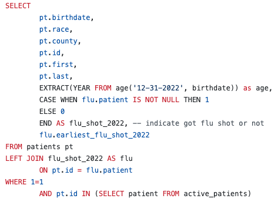

flu_shots_2022_dashboard
==============================

Building a dashboard presenting flu shots distribution for 2022. The datasets used in this project are synthetic healthcare data generated by Synthea. 

Metrics
------------
A. Portion (%) of patients getting flu shots stratified by
- age
- race
- county
- overall
  
B. Running total of flu shots over the year 2022 
C. Total number of flu shots given in 2022 
D. A list of patients identifying whether they received the flu shots (so we can follow up)

### Requirements
1. Patients must have been recently "Active at our hospital" (have 'encounters' within the last 2 years)
2. Patients must be at least 6 months old to receive the flu shots

[Dashboard](https://public.tableau.com/app/profile/mia.pham8473/viz/Immunization_2022_Dashboard/Dashboard1) (Click for an interactive and downloadable Tableau file)
------------
 
Figure 1. Immunization Distribution 2022 (Synthea data).

 
Figure 2. SQL query example.

Using the project
------------
#### Option 1: Write your own SQL + Tableau (Result files act as a guidance)
1. Load raw data files to a database
2. Run the SQL script in src/queries or write your own.
3. Download the final result table 
4. Use Tableau Public (web authoring) or Desktop version to create the dashboard 

#### Option 2: Create a dashboard Tableau 
1. Use the 'flushots-results.csv' file
2. Use Tableau Public (web authoring) or Desktop version to create the dashboard

Project Organization
------------

    ├── README.md          <- The top-level README for developers using this project.
    │
    ├── processed data     <- The final, canonical data sets for modeling.
    │            
    ├── raw data           <- The original, immutable data dump.
    │
    ├── reports            <- Generated analysis as HTML, PDF, LaTeX, etc.
    │   └── figures        <- Generated graphics and figures to be used in reporting
    │
    ├── src                <- Source code for use in this project.
    │   └── queries        <- Scripts to train models and then use trained models to make predictions
    
Licensing, Authors, Acknowledgements
------------
* The datasets and licensing are synthetically generated by project [Synthea](https://synthetichealth.github.io/synthea/)
* Project is inspired by Josh Matlock
